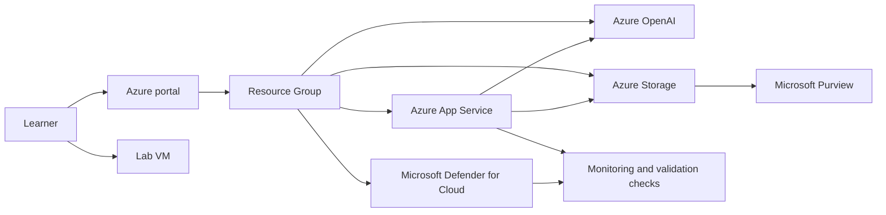

# Getting Started

## Introduction

In this lab, you will work with a clean Azure environment to deploy and secure a simple AI application that uses Azure OpenAI, Azure App Service, and Azure Storage. The focus of the lab is not only to understand how the application components fit together, but also to prepare for a Defender-led security and monitoring workflow across the AI application lifecycle. Microsoft Purview appears later in the lab as a supporting governance control to help you validate data governance outcomes alongside security posture.

Before you begin Exercise 1, use this page to orient yourself to the environment, confirm how to access the subscription, and understand the solution architecture you will secure.

## Lab scenario

Your organization is building an Azure-hosted AI application that exposes an application front end and API surface through Azure App Service, accesses deployed models through Azure OpenAI, and uses Azure Storage for application content or grounded data artifacts. You have been assigned to validate the baseline deployment and then harden it by applying security and governance controls throughout the lab.

The environment starts in a clean-build state. You will not begin with a pre-staged incident. Instead, you will deploy or review the baseline resources first, then progressively secure and validate the application lifecycle in the exercises that follow.

## Lab objectives

By the end of this lab, you should be able to:

- Explain the role of Azure OpenAI, Azure App Service, and Azure Storage in the solution.
- Identify where security controls and monitoring apply across the AI app lifecycle.
- Use Microsoft Defender experiences as the main security lens for posture and protection checks.
- Complete a supporting governance verification step using Microsoft Purview.
- Validate the final hardened state of the AI application environment.

## Sign in to the lab environment

1. Open a browser and go to <https://portal.azure.com>.
2. Sign in with the following lab credentials:
   - Username: `<inject key="AzureAdUserEmail"></inject>`
   - Password: `<inject key="AzureAdUserPassword"></inject>`
3. After sign-in, confirm that you are working in the correct subscription: `<inject key="SubscriptionID"></inject>`.
4. If you need to confirm the tenant context, verify that the tenant ID is `<inject key="TenantID"></inject>`.
5. Keep your deployment identifier available for later steps. Your deployment ID is **<inject key="DeploymentID" enableCopy="false"></inject>**.

> [!Tip]
> The Azure portal global search bar is the fastest way to locate resources and services during this lab. You will use it frequently to find the resource group, App Service app, storage account, Azure OpenAI resource, and security experiences.

## Lab access and workflow notes

- This lab uses a clean-build deployment model. You should expect the core resources to exist, but most security and governance configuration work is completed during the exercises.
- Azure OpenAI model access is tied to a deployed model on the Azure OpenAI resource. In Azure OpenAI workflows, applications call the **deployment name** of the model rather than only the base model name.
- Azure App Service is the application hosting layer for the sample AI app. It provides the web app runtime and is the place where you will review application-related configuration during the lab.
- Azure Storage is used to support application data, content, or grounded artifacts that participate in the broader AI app lifecycle.
- Microsoft Defender for Cloud is the primary security lens in this lab. Initial onboarding and configuration actions typically start in the Azure portal, while some cloud security experiences are also available in the Microsoft Defender portal.
- Microsoft Purview is included later as a supporting governance experience and is accessed through <https://purview.microsoft.com>.

## Architecture

The lab environment uses a compact Azure architecture that is intentionally simple so you can focus on securing the AI application lifecycle.

## Component overview

### Azure App Service

Azure App Service hosts the sample AI application front end or API surface. In this lab, it acts as the application entry point and the main workload you will inspect and harden. App Service is commonly used for AI-enabled web applications because it provides managed hosting and supports secure integration patterns.

### Azure OpenAI

Azure OpenAI provides model access for the application. The app interacts with a deployed model through the Azure OpenAI resource. As you move through the lab, you will review how this service fits into the application architecture and where its configuration influences the broader security posture.

### Azure Storage

Azure Storage supports application content, stored artifacts, or grounded data samples. Because AI applications often rely on stored content and supporting data flows, storage becomes an important part of the security and governance conversation.

### Microsoft Defender for Cloud

Microsoft Defender for Cloud is the main security thread for this lab. You will use Defender-oriented views and controls to review posture, protection recommendations, and monitoring outcomes relevant to the deployed AI application resources.

### Microsoft Purview

Microsoft Purview is used as a supporting governance control later in the lab. Its role in this scenario is to complement the security work by helping demonstrate a governance-focused outcome tied to the AI application's data estate.

## What you will do in the exercises

### Exercise 1

You will deploy or inspect the Azure AI application baseline, identify the key resources in the architecture, and confirm the environment is ready for security hardening.

### Exercise 2

You will apply security and governance controls to the AI application environment, using Defender-related controls as the primary thread and Purview as a supporting governance experience.

### Exercise 3

You will validate the end-to-end hardened state across application access, data handling, monitoring, and governance outcomes.

## Before you continue to Exercise 1

Make sure that you can complete the following checks:

- You can sign in to the Azure portal with `<inject key="AzureAdUserEmail"></inject>`.
- You can confirm the subscription `<inject key="SubscriptionID"></inject>`.
- You understand that the lab begins from a clean deployment state rather than an active incident state.
- You can identify the core platform components: App Service, Azure OpenAI, and Azure Storage.
- You are ready to use Defender as the primary security investigation and validation lens throughout the lab.

## After publishing

> [!Note] These steps run **after** you push the template to CloudLabs — they verify CloudLabs can actually serve this lab guide to candidates.

- **Verify docs-proxy access:** open Templates → your template → **Lab Guide Settings** in <https://admin.cloudlabs.ai> and confirm CloudLabs can reach this repo via the docs proxy. If the repo is private, configure GitHub access at the template level.
- **Verify inline questions and inline validations:** sign in to <https://admin.cloudlabs.ai>, open your template, and walk through one full lab run to confirm every `<question>` and `<validation step="..."/>` renders correctly. Fix any that don't resolve.
